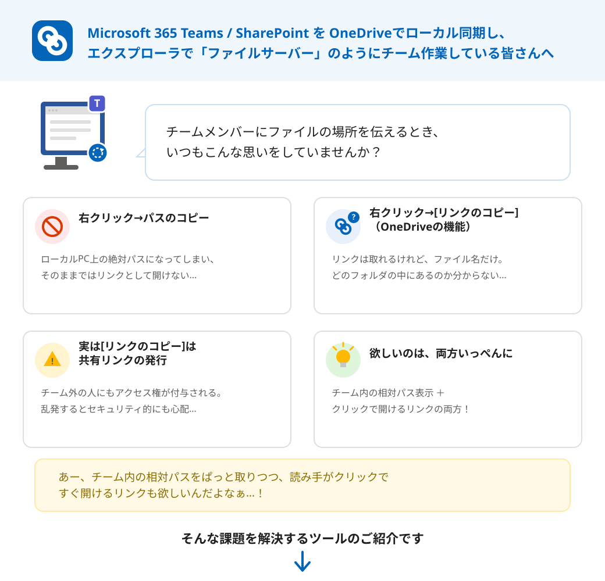

# CopyOneDriveLink

Microsoft 365 Teams / SharePoint を OneDriveでローカル同期し、エクスプローラを
「ファイルサーバー」のように使ってチーム作業している人向けの、Windows用
タスクトレイ常駐ツールです。

ファイルやフォルダを選んでホットキー（既定: `Ctrl+Alt+L`）を押す、または
右クリックメニュー／「送る」から実行するだけで、**「チーム内の相対パス」と
「クリックで開けるリンク」を1回でクリップボードにコピー**します。



## これ、困ってませんでしたか？

- 右クリック→**パスのコピー**は、ローカルPC上の絶対パスになってしまい、
  そのままではリンクとして開けない
- 右クリック→**[リンクのコピー]**（OneDriveの機能）は、ファイル名だけの
  リンクが取れるものの、どのフォルダの中にあるのか分からない
- しかも[リンクのコピー]は、実は**アクセス権付きの共有リンクを新規発行**
  する操作。チーム外の人にもアクセス権が付与されうるため、乱発するのは
  セキュリティ上好ましくない

CopyOneDriveLinkは、この「チーム内相対パス表示」と「クリックで開けるリンク」
を両方いっぺんに、かつ共有リンクを新規発行せずに実現します。
（詳細は[外部仕様](#外部仕様)を参照）

## 機能イメージ（実際にコピーされる文字列サンプル）

例えば、Teams「Marketing」チームの「ProjectA」チャネルに同期されたフォルダの
中の `Documents` フォルダにある `2026-08_Minutes.docx` を選んでホットキーを
押すと、既定の設定では以下のような文字列がコピーされます。

プレーンテキストとして貼り付けた場合（既定テンプレート）:

```text
チーム   : Marketing
チャネル : ProjectA
ファイル : Documents/2026-08_Minutes.docx
直接URL  : https://contoso.sharepoint.com/sites/Marketing/ProjectA/Documents/2026-08_Minutes.docx
```

Teamsのチャット等、リッチテキストとして貼り付けた場合（既定テンプレート）は、
「Marketing」「ProjectA」「Documents/」の部分がそれぞれクリック可能な
リンクになった状態で貼り付けられます（`ファイル名` 部分もリンク）。
ファイル名・フォルダ名に日本語が含まれる場合、URL部分は自動的にパーセント
エンコードされます（表示テキスト側は未エンコードのまま）。

個人用OneDrive領域のファイルの場合は、チーム/チャネルの概念が無いため、
専用の簡略テンプレートが使われます（後述の[設定イメージ](#設定イメージ)参照）。
また、個人用領域のリンクは他人がアクセス権を持っていないと開けないため、
コピー時にバルーン通知で注意を表示します。

テンプレートはユーザーごとに自由にカスタマイズできます。

## 設定イメージ

タスクトレイアイコンを右クリック→「設定...」から、GUIで以下を設定できます。

**全般タブ**

- ホットキーの変更（「キーを押して変更...」でキャプチャ。他アプリとの競合や
  定番ショートカットとの重複を自動チェック）
- 連携設定（クリックで即座に有効/無効。保存ボタン不要）
  - エクスプローラの「送る」に登録する
  - ログオン時に自動起動する（タスクトレイ常駐）
  - 右クリックメニューに直接登録する（すべてのファイル種別が対象）

**フォーマットタブ**

「Teams/SharePoint」「個人用OneDrive」の2つのサブタブで、プレーンテキスト用
／HTML用のテンプレートをそれぞれ自由に編集できます。使用できる変数は以下の
通りです。

| 変数 | 内容 |
| --- | --- |
| `$SiteName` / `$SiteLink` | サイト（チーム）名 / そのリンク付き |
| `$ChannelName` / `$ChannelLink` | チャネル名 / そのリンク付き |
| `$RelativeDir` / `$RelativeDirLink` | 相対パスのフォルダ部分 / そのリンク付き |
| `$FileName` / `$FileLink` | ファイル名 / そのリンク付き |
| `$RelativePath` / `$RelativePathLink` | フォルダ＋ファイル名の相対パス全体 / そのリンク付き |
| `$Url` / `$UrlLink` | 完全URL / そのリンク付き |

（`$SiteName` / `$SiteLink` / `$ChannelName` / `$ChannelLink` は
「個人用OneDrive」タブには表示されません。個人用OneDrive領域には
サイト・チャネルの概念が無いためです。）

## 使い方

1. [インストール](#インストール)を行い、常駐アプリを起動する
2. エクスプローラでファイルまたはフォルダを1つ選択する
3. 次のいずれかを実行する
   - ホットキー（既定: `Ctrl+Alt+L`）を押す
   - 右クリックメニューに登録している場合は「OneDrive共有リンクをコピー」
   - 「送る」に登録している場合はコピー先として選択
4. コピー完了のバルーン通知が出たら、Teamsのチャット等に貼り付ける

## インストール

1. このリポジトリ（フォルダ）一式をダウンロード・展開する
2. `setup\Install.bat`（または `setup\Install.ps1`）を実行する
   - `%LOCALAPPDATA%\CopyOneDriveLink\` へ本体一式がコピーされ、そこから
     常駐アプリが起動します（ダウンロードフォルダ等、一時的な場所からの
     直接運用は、後でフォルダを移動・削除すると連携設定が壊れてしまうため
     非推奨です）
   - 既にインストール済みの場所にある `Config.json`（ユーザー設定）は
     上書きされず温存されます
   - 既に常駐アプリが起動中の場合は、停止してよいか確認したうえで、Y/Nの
     回答に応じて安全に差し替えます（アップデート時の再実行に対応）
3. インストール完了後、タスクトレイアイコンを右クリック→「設定...」から、
   「送る」／自動起動／右クリックメニューなど、必要な連携を有効にする

インストール完了後は、ダウンロードフォルダ等にある元のフォルダは削除して
問題ありません。

## 外部仕様

- ローカルの同期フォルダ情報は、レジストリ
  `HKCU\Software\SyncEngines\Providers\OneDrive\<GUID>` から取得します
  （PCごとのドライブ文字・フォルダ名の違いを自動的に吸収）
- コピーされるURLは、SharePoint UIの「リンクのコピー」で発行される
  アクセス権付き共有リンクとは別物で、アイテム固有GUIDを含まない
  **サーバー相対URL**です。新たにアクセス権を発行することはありません
  （＝チーム外の人には開けません。これは意図した挙動です）
- クリップボードにはプレーンテキストとHTML（リッチテキスト）を同時に
  書き込むため、貼り付け先の種類に応じて自動的に適切な形式が使われます
- 設定は `Config.json`（インストール先の `src` フォルダ内）に保存されます

## 動作環境

- Windows 11 25H2 で動作確認済み
- Windows PowerShell 5.1 (`powershell.exe`) と .NET Framework（WinForms）を
  前提としているため、理論上はこれらを標準搭載する Windows 10 でも動作する
  可能性がありますが、未検証です
- OneDriveクライアントによるTeams/SharePointライブラリまたは個人用OneDrive
  領域のローカル同期が必要です

## 使用ライブラリ

サードパーティ製ライブラリへの依存はありません。Windows/PowerShellに
標準で含まれる以下のみを使用しています。

- Windows PowerShell 5.1（スクリプト実行環境）
- .NET Framework（`System.Windows.Forms` / `System.Drawing` /
  `System.Threading` など）
- Win32 API（`RegisterHotKey` 等のグローバルホットキー処理、クリップボードへの
  直接書き込みのため、P/Invoke経由で呼び出し）

## 既知の制約

- Windows 11の新しい右クリックメニュー（既定表示）には対応していません。
  クラシックメニュー（「その他のオプションを表示」）からのみ利用できます
- その他の調査経緯は [docs/](docs/) 以下の各ドキュメントを参照してください

## ライセンス

[MIT License](LICENSE)

## 作者

Yukinori Sone <yukinori_sone@kun-world.com>
